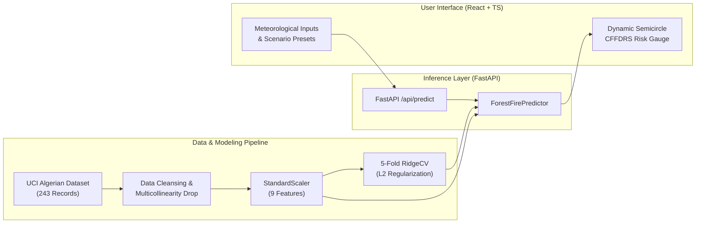

# Algerian Forest Fires — Fire Weather Index (FWI) Prediction

[](https://www.python.org/)
[](https://fastapi.tiangolo.com/)
[](https://react.dev/)
[](https://www.typescriptlang.org/)
[](https://tailwindcss.com/)
[](https://scikit-learn.org/)
[](LICENSE)

An end-to-end machine learning system that predicts wildfire danger using the Canadian Forest Fire Weather Index (FWI) framework. Trained on meteorological and environmental observations from two distinct bioclimatic regions in Northern Algeria, the project combines an exploratory data analysis pipeline, regularized regression modeling, a validated FastAPI inference service, and a responsive React/TypeScript analytical dashboard.

---

## 📌 Project Overview

Wildfires in Mediterranean climate ecosystems pose severe ecological and socioeconomic hazards. Early hazard estimation relies heavily on the **Canadian Forest Fire Weather Index (FWI) System**, a meteorological framework that measures fuel moisture content and fire behavior characteristics based solely on weather observations.

This project investigates weather drivers of wildfire occurrence in Northern Algeria, handles severe multicollinearity among moisture codes, evaluates multiple regularized linear models, and operationalizes the top-performing estimator through a modern, accessible web interface.



---

## 🔬 Dataset & Feature Engineering

The underlying data originates from the **UCI Machine Learning Repository** and captures observations recorded from June 2012 to September 2012 across two Algerian administrative regions:
1. **Bejaia Region**: Northeast coastal Algeria with Mediterranean maritime influence.
2. **Sidi Bel-abbes Region**: Northwest Algeria characterized by inland, semi-arid conditions.

### Multicollinearity & Feature Selection
Exploratory data analysis revealed severe linear dependencies among Canadian fire weather sub-indices:
- **Build Up Index (`BUI`)** exhibited correlation $r > 0.90$ with the **Duff Moisture Code (`DMC`)**.
- **Drought Code (`DC`)** demonstrated severe collinearity ($r > 0.85$) with `DMC`.

Including collinear regressors in ordinary least squares leads to high estimator variance and unstable coefficients. Consequently, `BUI` and `DC` were dropped, isolating **9 independent features** for modeling:

| Feature | Unit / Scale | Meteorological Significance |
| :--- | :---: | :--- |
| **`Temperature`** | 10.0 to 50.0 °C | Noon ambient surface temperature driving fuel evaporation |
| **`RH`** | 10.0 to 100.0 % | Relative humidity governing fuel moisture equilibrium |
| **`Ws`** | 1.0 to 50.0 km/h | 10-meter open-ground wind speed driving flame propagation |
| **`Rain`** | 0.0 to 30.0 mm | Cumulative precipitation replenishing surface organic moisture |
| **`FFMC`** | 20.0 to 100.0 | Fine Fuel Moisture Code; reflects surface litter flammability |
| **`DMC`** | 1.0 to 100.0 | Duff Moisture Code; reflects drying rate of loosely compacted organic layers |
| **`ISI`** | 0.0 to 35.0 | Initial Spread Index; combines wind speed and FFMC to model rate of spread |
| **`Classes`** | Binary (0 / 1) | Ground activity state (0 = Not Fire, 1 = Fire Detected) |
| **`Region`** | Binary (0 / 1) | Geographic demarcation (0 = Bejaia, 1 = Sidi Bel-abbes) |

**Target Variable**: **`FWI`** (Fire Weather Index), a continuous dimensionless numerical index representing frontal fire intensity.

---

## ⚙️ Model Evaluation & Selection

Multiple linear regression variants were trained and benchmarked using a 75/25 train-test split:

- **Ordinary Least Squares (Linear Regression)**: Base reference; sensitive to residual inter-feature correlations.
- **Lasso Regression ($\ell_1$-norm)**: Enforced sparsity, but penalized correlated meteorological drivers too aggressively.
- **ElasticNet**: Blended $\ell_1/\ell_2$ penalty; offered competitive error rates but increased hyperparameter complexity.
- **Ridge Regression ($\ell_2$-norm)**: Penalized coefficient magnitudes proportionally ($\lambda$), stabilizing regression weights against correlated indices without discarding predictive signals.

**Final Selected Model**: **Ridge Regression** optimized via 5-Fold Cross-Validation (`RidgeCV`). The fitted model and its corresponding `StandardScaler` are serialized in the [`models/`](models/) directory for reproducible deployment.

### Hazard Classification Mapping (CFFDRS)
In operational wildfire management, numeric FWI values are categorized into discrete danger classes:

$$\begin{aligned}
\text{Low} &\quad : \quad \text{FWI} < 5.2 \\
\text{Moderate} &\quad : \quad 5.2 \le \text{FWI} < 13.0 \\
\text{High} &\quad : \quad 13.0 \le \text{FWI} < 21.3 \\
\text{Very High} &\quad : \quad 21.3 \le \text{FWI} < 38.0 \\
\text{Extreme} &\quad : \quad \text{FWI} \ge 38.0
\end{aligned}$$

---

## 💻 Architecture & Interface Design

The application is structured into two decoupled, production-tested layers:

### Backend Architecture (`src/backend`)
- **Framework**: FastAPI with asynchronous lifecycle management.
- **Type Safety & Defensive Validation**: Strict Pydantic v2 schemas validating physical parameter bounds and categorical state constraints.
- **Inference Engine**: Encapsulated `ForestFirePredictor` converting raw requests into labeled DataFrames matching pre-fitted scaler feature signatures, avoiding scikit-learn warnings and negative prediction edge cases.
- **Unified Static Serving**: The backend mounts the built React distribution directory (`src/frontend/dist`), enabling full-stack delivery from a single server process.

### Frontend Architecture (`src/frontend`)
- **Stack**: React 18, TypeScript, Vite, Tailwind CSS, Lucide icons.
- **Restrained Visual Design**: Purposeful, utility-first layout strictly avoiding AI aesthetic clichés, excessive card borders, or arbitrary gradients.
- **Precision Inputs**: Synchronized range sliders and numeric input boxes with physical units and dynamic gradient track fills.
- **Mathematical Semicircle Dial**: Custom SVG radial arc generated via polar trigonometry with a rotating needle mapped piecewise across the 5 CFFDRS danger zones.
- **Accessibility & Themes**: Built-in Dark and Light themes with system preference detection and `localStorage` state persistence.
- **Historical Scenario Presets**: Pre-configured historical observation sets (*Post-Rain Safe Baseline*, *Typical Mediterranean Summer*, *Severe Heatwave & Drought*) for instant scenario simulation.

---

## 📁 Repository Structure

```text
algerian-forest-fire-prediction/
├── data/
│   ├── raw/                           # Original UCI CSV dataset
│   └── processed/                     # Cleaned dataset (243 records)
├── models/
│   ├── ridge.pkl                      # Serialized Ridge model (scikit-learn 1.9.0)
│   └── scaler.pkl                     # Serialized StandardScaler
├── notebooks/
│   ├── 01-eda-feature-engineering.ipynb      # Cleaning, distributions & correlation analysis
│   └── 02-model-training-evaluation.ipynb    # Model training, cross-validation & artifact export
├── src/
│   ├── backend/                       # FastAPI application service
│   │   ├── main.py                    # Routing, static mounting, lifecycle management
│   │   ├── predictor.py               # Preprocessor transformation & regression inference
│   │   └── schemas.py                 # Pydantic request, response, and metadata schemas
│   └── frontend/                      # React + TypeScript single-page application
│       ├── src/
│       │   ├── components/
│       │   │   ├── DangerGauge.tsx    # Trigonometric semicircle dial
│       │   │   ├── MetricInput.tsx    # Dual slider + numeric input
│       │   │   ├── Navbar.tsx         # Header & theme toggle
│       │   │   └── PresetsBar.tsx     # Scenario selector
│       │   ├── hooks/useTheme.ts      # Theme persistence hook
│       │   ├── services/api.ts        # Typed API client
│       │   ├── App.tsx                # Responsive 12-column layout
│       │   └── index.css              # Cross-browser range slider styling
│       ├── package.json
│       ├── tailwind.config.js
│       └── vite.config.ts
├── tests/
│   └── test_api.py                    # Pytest suite (inference, validation, static delivery)
├── .dockerignore
├── .gitignore
├── Dockerfile                         # Production multi-stage container build
├── LICENSE
├── requirements.txt                   # Backend Python dependencies
└── README.md
```

---

## 🔌 API Endpoints

| Method | Endpoint | Description |
| :--- | :--- | :--- |
| `GET` | `/api/health` | Service health status and artifact initialization check |
| `GET` | `/api/meta` | Feature definitions, parameter limits, CFFDRS thresholds, and presets |
| `POST` | `/api/predict` | Validates 9 inputs, scales features, and returns predicted FWI + risk level |
| `GET` | `/docs` | Interactive Swagger / OpenAPI documentation |

### Example Prediction Request
```json
{
  "temperature": 30.0,
  "rh": 64.0,
  "ws": 15.0,
  "rain": 0.0,
  "ffmc": 86.0,
  "dmc": 14.2,
  "isi": 5.7,
  "classes": 1,
  "region": 0
}
```

### Example Prediction Response
```json
{
  "fwi": 7.16,
  "danger_level": "Moderate",
  "danger_color": "amber",
  "description": "Surface fires may ignite and burn with moderate intensity. Controllable with standard resources.",
  "features_used": {
    "temperature": 30.0,
    "rh": 64.0,
    "ws": 15.0,
    "rain": 0.0,
    "ffmc": 86.0,
    "dmc": 14.2,
    "isi": 5.7,
    "classes": 1,
    "region": 0
  }
}
```

---

## ⚡ Quickstart

### Prerequisites
- Python 3.11+
- Node.js 18+ (for frontend development)

### 1. Environment Setup
```bash
# Clone the repository
git clone https://github.com/<your-username>/algerian-forest-fire-prediction.git
cd algerian-forest-fire-prediction

# Initialize virtual environment and install dependencies
python -m venv venv
source venv/bin/activate  # On Windows: venv\Scripts\activate
pip install -r requirements.txt
```

### 2. Run Tests
```bash
pytest tests/ -v
```

### 3. Run the Application

**Option A — Unified Production Mode (FastAPI serves both API and UI)**:
```bash
cd src/frontend && npm install && npm run build && cd ../..
uvicorn src.backend.main:app --port 8000
```
*Access the application at `http://localhost:8000`.*

**Option B — Independent Frontend Development**:
```bash
# Terminal 1: Backend API
uvicorn src.backend.main:app --reload --port 8000

# Terminal 2: Vite Dev Server
cd src/frontend && npm run dev
```
*Access the dev UI at `http://localhost:5173`.*

---

## 📜 Citation & License

- **Dataset**: Cortez, P., & Morais, A. (2012). *Algerian Forest Fires Dataset*. UCI Machine Learning Repository.
- **License**: Distributed under the [MIT License](LICENSE).